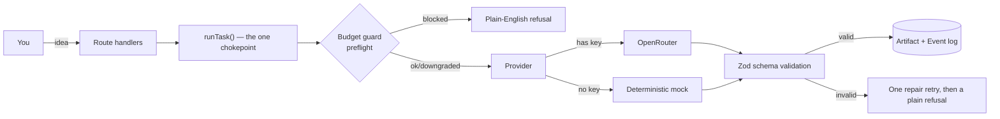

<div align="center">

# Nucleus 2.0

**A self-hosted venture copilot that validates ideas, plans them, scopes an
MVP, and hands off a build-ready spec — all under a $50/month AI budget it
cannot structurally exceed.**

[](https://github.com/umutalp1071/nucleus-2.0/actions/workflows/ci.yml)
[](LICENSE)
[](https://nextjs.org)
[](tsconfig.json)

</div>

---

## What Nucleus is — and isn't

Nucleus takes a raw idea and runs it through a real venture lifecycle:

```
captured → validated → planned → building → launched → growing
              │
              └──▶ killed        (a first-class, celebrated outcome)
```

At each stage it does the work an AI-first "app builder" skips: it tells you
honestly whether an idea is worth pursuing, produces a positioning + MVP plan
with an explicit kill criterion, and — as of the current phase — expands that
plan into checkable build tasks and a handoff spec formatted for a human
developer, Claude Code, or Lovable/v0/Bolt.

**It does not generate your application's source code.** That's a deliberate
scope decision, not a gap — every AI app builder ends at "here's your app"
and leaves you alone with the actual hard part. Nucleus hands a precise,
testable spec to whatever *does* write the code, and keeps running the
business around it. See [`docs/plan/00-ANSWER.md`](docs/plan/00-ANSWER.md)
for the full reasoning.

## Why it's built this way

Four requirements, taken literally as engineering constraints rather than as
marketing copy:

| The vision says | Which means, concretely |
|---|---|
| "your own computer, your own control" | No mandatory cloud account. Every AI/deploy dependency has a deterministic mock, selected by the absence of a key — the app runs fully offline, with zero setup. |
| "a venture studio" | The unit of work is a **venture** with a lifecycle, artifacts, and spend — not a chat thread, not a file. |
| "without technical knowledge" | You never see a model name, a token count, a prompt, or a stack trace. Every user-facing error is a plain sentence. |
| "$50/month budget" | The budget is a **pre-flight guard enforced before every AI call**, not a number on a dashboard that's already wrong by the time you read it. |

## How it works



Five decisions carry the whole system — the rest is detail:

1. **One chokepoint for all AI traffic.** Every model call goes through
   `runTask()` in [`src/server/ai/gateway.ts`](src/server/ai/gateway.ts).
   Nothing else may talk to a model — a boundary test fails the build if any
   other file references the provider host.
2. **The budget is a pre-flight guard, not a report.** Spend is derived by
   *summing the call ledger* over daily/weekly/monthly windows, never a
   stored counter that can drift out of sync with reality.
3. **Every AI output is schema-validated at one boundary.** Every task
   declares a Zod schema; the gateway validates, retries once on failure with
   the validation error appended, then fails loudly. No `JSON.parse` ever
   happens in a component.
4. **An append-only event log is the source of truth for everything
   narrative** — the activity feed, the build-in-public content generator,
   and the session learning log all read from the same log.
5. **Local-first storage, adapters at the edges.** Data lives as plain JSON
   under `.nucleus/` — a file you can open, back up, or delete. AI provider
   and deploy target each have exactly two implementations (`openrouter |
   mock`, `vercel | mock`), selected once at load, so the whole system stays
   testable and demoable with zero external accounts.

Full detail: [`docs/plan/ARCHITECTURE.md`](docs/plan/ARCHITECTURE.md) (target
system) and [`docs/plan/00-ANSWER.md`](docs/plan/00-ANSWER.md) (the reasoning
behind it).

## Quickstart

```bash
git clone https://github.com/umutalp1071/nucleus-2.0.git
cd nucleus-2.0
npm install
npm run dev      # http://localhost:3000
```

No account, no API key, no configuration step. Nucleus starts in **demo
mode** — every AI call returns a realistic, schema-valid mock response
instantly and for free, so you can walk the entire venture lifecycle before
deciding whether to connect a real key.

To switch to live AI, add your own [OpenRouter](https://openrouter.ai/keys)
key in **Settings** inside the running app (or copy
[`.env.example`](.env.example) to `.env.local`) — it takes effect on the very
next request, no restart required. Spend is capped at $10/day, $30/week,
$50/month by default, enforced before each call, and configurable in
Settings.

```bash
npm run verify   # tsc --noEmit && next lint && vitest run — run before every commit
```

## What works today

| Stage | What it does |
|---|---|
| **Capture → Validate** | Turns a raw idea into a scored verdict (build / refine / kill), a competitor analysis, and an honest "why not" — the validator is required to argue against the idea it just described. |
| **Plan** | Positioning, ICP with concrete named channels, differentiation, a first-10-users plan, and a required kill criterion. |
| **Scope MVP** | Core loop, must-have features capped at 5, explicit cuts floored at 3, 3–6 milestones, a stack recommendation. |
| **Build** | Milestones become checkable tasks (zero AI calls — the plan already has the content), and a `generate-build-spec` task produces a handoff document — user stories with acceptance criteria, a data model, screens, an explicit out-of-scope list, and the literal first commit — exported as Markdown, a coding-agent brief, or a Lovable/v0/Bolt prompt. |
| **Launch, Growth, Build-in-public** | Planned — see [`docs/plan/PROGRESS.md`](docs/plan/PROGRESS.md) for current phase status. |

Every artifact above is versioned, never overwritten, and regenerable with
your feedback appended to the prompt.

## Security

Summarized here; full detail in [`SECURITY.md`](SECURITY.md).

- Your AI key never leaves your machine except to call OpenRouter itself —
  enforced by a boundary test, not just convention — and is never echoed
  back to the browser once saved (only a redacted preview).
- No key or account is required to run the app at all.
- All data stays on your disk under `.nucleus/`, which is `.gitignore`d.
- No authentication — deliberate for a single-operator, localhost-first tool.
  Put it behind your own auth if you deploy it somewhere network-reachable.
- `npm audit` currently flags high-severity advisories in `next@14.2.35` with
  no fix on the 14.2.x line; the breaking major-version upgrade that resolves
  them is tracked in [`docs/plan/BACKLOG.md`](docs/plan/BACKLOG.md) rather
  than patched in isolation.

To report a vulnerability, please use [GitHub's private advisory
form](https://github.com/umutalp1071/nucleus-2.0/security/advisories/new)
rather than a public issue.

## Project status & development

This project is built phase-by-phase against a written plan, test-driven,
with every phase gated on `npm run verify` passing and a real-browser check —
see [`docs/plan/PROGRESS.md`](docs/plan/PROGRESS.md) for exactly where things
stand, [`docs/plan/CONVENTIONS.md`](docs/plan/CONVENTIONS.md) for the
definition of done, and [`docs/content/drafts/`](docs/content/drafts/) for
the build-in-public log written alongside each phase.

## License

[MIT](LICENSE) © 2026 Umut Alp
